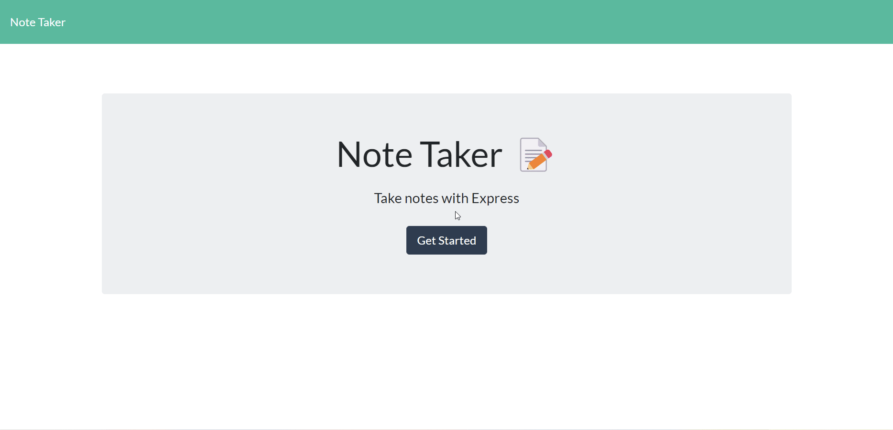

# Note-Taker

### **This Note Taker project was created as an Express.js  application that helps the user to write and save notes organizing thoughts and keepping track of tasks that need to be completed.** 

## **Local set up**

```
npm install
```

```
node server.js
```

## **How to use the application**

* When the user opens the Note Taker the user is presented with the "Get Started" button, and when they click it they are taken to the notes page. 

* On the notes page the user is presented with a page with existing notes listed in the left-hand column, plus empty fields to enter a new note title and the note’s text in the right-hand column.

* The Save button appears in the navigation at the top of the page when the user gives a title and content for the note.

* When the user clicks on the Save icon the new note is saved and appears in the left-hand column with the other existing notes.

* The user can click existing note in the list in the left-hand column and that note appears in the right-hand column.

* The user can enter a new note by clicking on the icon in the navigation at the top of the page.

* If the user would like to delete a note a red bin icon is provided to action this. 


### **Preview**

💡 Live version: [https://fierce-hamlet-91598.herokuapp.com](https://fierce-hamlet-91598.herokuapp.com)



